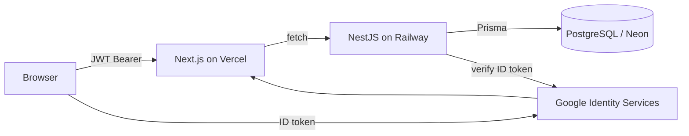

<div align="center">

# 🎧 Beathub

**An admin dashboard for a modern music platform** — label & roster management, content moderation, collaborative playlists, and an ad marketplace where creators promote their releases.

[](https://nextjs.org/)
[](https://react.dev/)
[](https://nestjs.com/)
[](https://www.prisma.io/)
[](https://neon.tech/)
[](https://www.typescriptlang.org/)

[Live demo](https://beathub-six.vercel.app) · [Getting started](#-getting-started) · [Architecture](#️-architecture)

</div>

---

## 📸 Screenshots

> _Add your own captures here — the login/welcome screen and a couple of dashboard views show the project off best._

| Welcome screen | Dashboard |
| --- | --- |
| `./docs/login.png` | `./docs/dashboard.png` |

---

## Overview

Beathub is a full-stack, production-deployed web app that gives a music platform's team a single workspace to run the business side of the catalogue. Admins moderate uploaded tracks, labels manage their signed artists, creators apply for upgraded roles and promote releases through a self-serve ad marketplace, and everyone collaborates on playlists — all behind a fast, keyboard-friendly, pure-dark interface.

It's built as a pnpm monorepo with a **Next.js** front end and a **NestJS + Prisma** API, and ships with a fully custom authentication system (email/password **and** Google OAuth) issuing its own JWT sessions.

## ✨ Features

- **🔐 Custom authentication** — email + password (bcrypt-hashed) and "Continue with Google" (Google Identity Services). One account per email: signing in with Google links to an existing password account instead of duplicating it. Strong-password rules enforced with live feedback.
- **👥 Teams, roles & personas** — role lives on the membership, not the user, so one person can belong to multiple teams. `OWNER` / `ADMIN` / `MEMBER`, with member personas (Listener, Creator, Label rep) that tailor the UI. The configured owner email is always reconciled to `OWNER` on sign-in.
- **🎵 Content library & moderation** — upload audio, extract metadata, review and approve/flag tracks, stream and count plays.
- **🏷️ Label management** — labels invite and manage a roster of signed artists, view label stats, and handle incoming/outgoing invites.
- **📝 Applications workflow** — listeners apply to become creators; users apply to run a label. Admins approve or decline from the dashboard.
- **📻 Collaborative playlists** — create playlists, add tracks, invite members, and manage collaborators.
- **📣 Ad marketplace** — creators request promotion campaigns; admins review and action them.
- **📊 Analytics** — dashboards with charts and status pills that surface what needs attention at a glance.
- **⌘ Command palette** — jump anywhere with ⌘K.
- **🌘 Pure-dark design system** — a hand-tuned OKLCH theme with an electric-violet accent, built on shadcn/ui and Tailwind CSS v4, with a matching light mode.

## 🧱 Tech stack

| Layer | Technology |
| --- | --- |
| **Frontend** | Next.js 16 (App Router), React 19, TypeScript, Tailwind CSS v4, shadcn/ui, Recharts, Turbopack |
| **Backend** | NestJS 11, TypeScript, Prisma 7, class-validator |
| **Database** | PostgreSQL (Neon / Railway) |
| **Auth** | Custom JWT (`jsonwebtoken`), `bcrypt`, Google OAuth (`google-auth-library`) |
| **Tooling** | pnpm workspaces, ESLint, Prettier |
| **Hosting** | Frontend → Vercel · API → Railway · DB → Neon |

## 🏗️ Architecture



The browser holds a JWT (issued by the API) in `localStorage` and sends it as an `Authorization: Bearer` header — no cross-site cookies, which keeps CORS simple across the Vercel ↔ Railway origins. A NestJS guard verifies the token, loads the user, bootstraps their default team membership, and attaches it to the request; a roles guard then enforces per-team permissions on protected routes.

## 🔑 Roles & permissions

| Role | Capabilities |
| --- | --- |
| `OWNER` | Full control of the workspace (assigned via `OWNER_EMAIL`) |
| `ADMIN` | Moderation, application decisions, team management |
| `MEMBER` | Persona-driven: **Listener** (browse, apply), **Creator** (upload, promote), **Label rep** (manage roster) |

## 📂 Project structure

```
beathub/
├── frontend/                 # Next.js app (App Router)
│   ├── app/                  # Routes: /login, /dashboard/*, /invite/[token]
│   ├── components/           # UI + layout (shadcn/ui based)
│   ├── lib/                  # auth context, api client, hooks
│   └── app/globals.css       # OKLCH design tokens (light + dark)
└── backend/                  # NestJS API
    ├── src/
    │   ├── auth/             # JWT, Google verification, guards
    │   ├── teams/ content/ playlists/ labels/ campaigns/
    │   ├── creator-applications/ invitations/ me/ system/
    │   └── prisma/           # Prisma service
    └── prisma/schema.prisma  # Data model + migrations
```

## 🚀 Getting started

### Prerequisites

- Node.js ≥ 20
- pnpm ≥ 10
- A PostgreSQL database (local, or a free [Neon](https://neon.tech) instance)
- A Google OAuth **Client ID** ([Google Cloud Console](https://console.cloud.google.com) → Credentials → OAuth client → Web application)

### 1. Backend

```bash
cd backend
pnpm install

# create backend/.env (see variables below), then:
pnpm prisma migrate dev      # apply the schema
pnpm start:dev               # http://localhost:4000
```

### 2. Frontend

```bash
cd frontend
pnpm install

# create frontend/.env.local (see variables below), then:
pnpm dev                     # http://localhost:3000
```

### Environment variables

**`backend/.env`**

| Variable | Description |
| --- | --- |
| `DATABASE_URL` | PostgreSQL connection string |
| `AUTH_JWT_SECRET` | Long random string used to sign session tokens |
| `GOOGLE_CLIENT_ID` | Google OAuth Web client ID |
| `OWNER_EMAIL` | Email that is granted the `OWNER` role |
| `FRONTEND_ORIGIN` | Allowed CORS origin(s), comma-separated |

**`frontend/.env.local`**

| Variable | Description |
| --- | --- |
| `NEXT_PUBLIC_API_URL` | Base URL of the backend API |
| `NEXT_PUBLIC_GOOGLE_CLIENT_ID` | Same Google client ID as the backend |

> Generate a secret with `node -e "console.log(require('crypto').randomBytes(48).toString('hex'))"`.
> For Google sign-in, add your app origin (e.g. `http://localhost:3000`) to the client's **Authorized JavaScript origins**.

## 📜 Scripts

| Location | Command | Purpose |
| --- | --- | --- |
| `frontend` | `pnpm dev` / `pnpm build` | Run / build the Next.js app |
| `backend` | `pnpm start:dev` | Run the API in watch mode |
| `backend` | `pnpm build && pnpm start` | Production build & run |
| `backend` | `pnpm prisma migrate dev` | Create & apply a migration |
| `backend` | `pnpm prisma studio` | Browse the database |

## ☁️ Deployment

- **Frontend** → Vercel. Set `NEXT_PUBLIC_API_URL` and `NEXT_PUBLIC_GOOGLE_CLIENT_ID`.
- **API** → Railway. Set all backend env vars; the app listens on `0.0.0.0:$PORT`. Run `pnpm prisma migrate deploy` against the production database.
- **Database** → Neon (or Railway Postgres).

## 🛠️ Engineering highlights

- Designed and shipped a **custom auth system**, replacing a third-party provider with email/password + Google OAuth and self-issued JWTs — including account linking so one email never yields two accounts.
- Built a **cohesive dark design system** from scratch in OKLCH with light/dark parity, keeping semantic status colours separate from the brand accent.
- Modelled a non-trivial **multi-tenant domain** (teams, memberships, roles, personas, applications, playlists, campaigns) with Prisma migrations.
- Debugged and fixed real production issues end-to-end: cross-origin CORS, container port binding on Railway, and an incremental-build caching bug.

---

<div align="center">

Built by **[Olowodarey](https://github.com/Olowodarey)**

</div>
